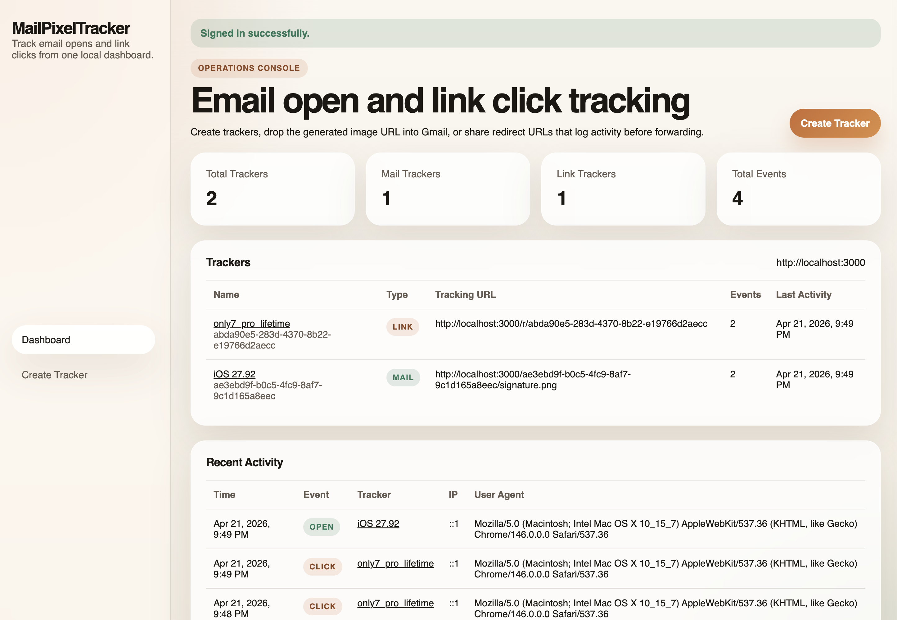

# MailPixelTracker

MailPixelTracker is a local Express + SQLite app for:



- creating email pixel trackers
- creating redirect link trackers
- logging opens and clicks with timestamp, IP, referer, and user agent
- viewing tracker history in a password-protected dashboard
- sending optional Telegram bot alerts for new opens and clicks

## Features

- Session-based dashboard login with a 1 hour session timeout
- Mail tracker URLs like `https://your-host/<uuid>/signature.png`
- Link tracker URLs like `https://your-host/r/<uuid>`
- Optional custom image upload for mail trackers, stored locally in `data/pixels`
- SQLite-backed event history and tracker list
- CRM-style dashboard for summaries and per-tracker drilldown
- Optional Telegram notifications through a bot token + chat ID

## Stack

- Node.js
- Express
- sqlite3
- express-session
- multer

## Setup

1. Install dependencies:

```bash
npm install
```

2. Copy the example env file and edit it:

```bash
cp .env.example .env
```

3. Set at minimum:

- `APP_USERNAME`
- `APP_PASSWORD`
- `SESSION_SECRET`
- `PORT`

4. Optional Telegram settings:

- `TELEGRAM_BOT_TOKEN`
- `TELEGRAM_CHAT_ID`

5. Start the app:

```bash
npm run dev
```

Then open `http://localhost:3000`.

## Environment Variables

| Variable | Required | Description |
| --- | --- | --- |
| `PORT` | No | HTTP port, defaults to `3000` |
| `APP_BASE_URL` | No | Informational base URL shown in env, not required by runtime |
| `APP_USERNAME` | Yes | Dashboard login username |
| `APP_PASSWORD` | Yes | Dashboard login password |
| `SESSION_SECRET` | Yes | Express session secret |
| `DB_PATH` | No | SQLite database path |
| `PIXEL_STORAGE_DIR` | No | Directory for uploaded mail tracker images |
| `TELEGRAM_BOT_TOKEN` | No | Telegram bot token for alerts |
| `TELEGRAM_CHAT_ID` | No | Telegram chat ID that receives alerts |

The app also accepts legacy `BASIC_AUTH_USER` and `BASIC_AUTH_PASS` names for compatibility.

## Usage

### Create a mail tracker

1. Sign in to the dashboard.
2. Open `Create Tracker`.
3. Enter a tracker name.
4. Optionally upload a custom image.
5. Submit the form.
6. Copy the generated tracking URL from the tracker detail page.

Example generated URL:

```text
https://your-host/550e8400-e29b-41d4-a716-446655440000/signature.png
```

### Add the pixel tracker in Gmail

Gmail strips a lot of raw HTML in the regular composer, so the most reliable workflow is to use an HTML signature or an email tool that can inject HTML.

Example image tag:

```html

```

If you are using a Gmail signature, add the image URL through the signature editor or through an HTML-capable mail workflow. When the recipient opens the email and the remote image loads, MailPixelTracker logs the event.

### Create a link tracker

1. Open `Create Tracker`.
2. Choose `Link Tracker`.
3. Enter a name and the destination URL.
4. Submit the form.
5. Share the generated `/r/<uuid>` URL.

When someone opens that link, the app logs the click first and then redirects to the target URL.

## Public vs protected routes

- The dashboard routes are protected behind the session login.
- The tracking endpoints are public by design, otherwise email clients and recipients could not load them.

## Project structure

```text
.
├── index.js
├── public/styles.css
├── src/app.js
├── src/db.js
├── src/render.js
└── data/
    └── pixels/
```

## Notes

- Many email clients proxy remote images, so the logged IP/user agent may be the mail provider instead of the recipient device.
- Some clients block remote images entirely until the recipient allows them.
- For production, put the app behind HTTPS and a reverse proxy.
